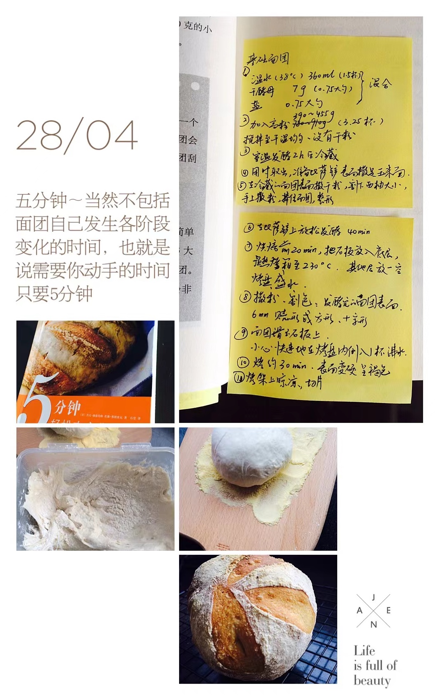

## 食材

> 6 人份

| 材料     | 量   | 备注 |
| :------- | :--- | :--- |
| 高筋面粉 | 450g |      |
| 温水     | 360g |      |
| 干酵母   | 4g   |      |
| 盐       | 4g   |      |

## 步骤

1. 取一个较大的食品冰盒，加入温水、干酵母、盐混合
2. 加入高粉搅拌至干湿均匀、没有干粉
3. 冷藏发酵一个晚上以上
4. 用时取出，准备比萨铲，表面撒玉米面
5. 在冷藏的面团表面撒干粉，割下西柚大小，手上撒粉，捧住面团，整形
6. 在比萨铲上放松发酵 40 分钟
7. 烤箱预热 200℃
8. 撒粉、割包
9. 面团快速划至烤盘上
10. 烤约 25 分钟，表面变硬呈褐色
11. 烤架上晾凉，切片

## 备注

- 高筋面粉可以适量全麦粉替代
