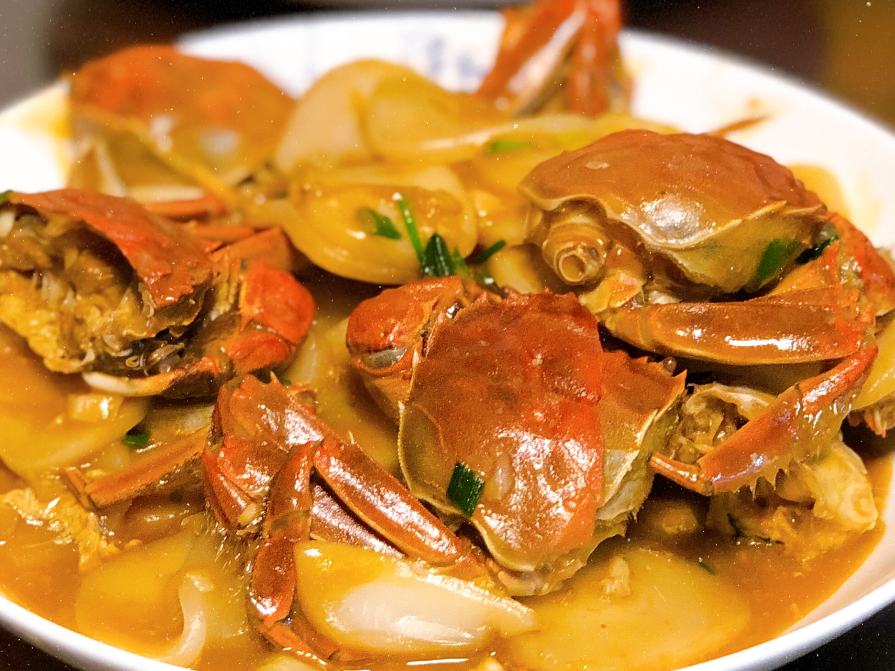

## 食材

> 2 ～ 3 人份

| 材料   | 量     | 备注 |
| :----- | :----- | :--- |
| 六月黄 | 4 个   |      |
| 年糕   | 200g   |      |
| 姜片   | 6 片   |      |
| 蒜末   | 1 勺   |      |
| 姜末   | 1 勺   |      |
| 生粉   | 适量   |      |
| 料酒   | 2 勺   |      |
| 生抽   | 2 勺   |      |
| 蚝油   | 2 勺   |      |
| 冰糖   | 1 小把 |      |

## 步骤

1. 六月黄斩对半，切面裹生粉
2. 热油下姜片
3. 煎六月黄
4. 放蒜末、姜末、各种作料
5. 加水没过六月黄，盖锅盖大火煮沸
6. 加年糕，中小火
7. 搅拌收汁
