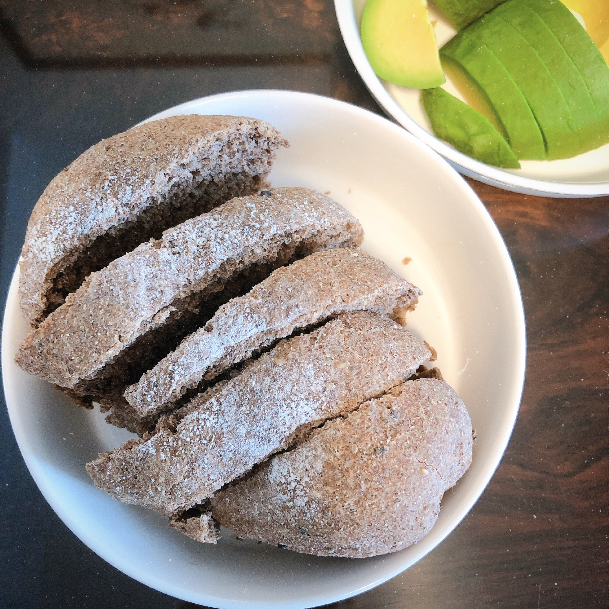

## 食材

> 2 人份

| 材料   | 量   | 备注                               |
| :----- | :--- | :--------------------------------- |
| 黑麦粉 | 400g |                                    |
| 酵母   | 4g   |                                    |
| 盐     | 3g   |                                    |
| 水     | 300g | 水可能不需要这么多，不要一次性加完 |
| 玉米油 | 15g  |                                    |
| 坚果   | 适量 | 可选                               |
| 葡萄干 | 适量 | 可选                               |
| 黑芝麻 | 适量 |                                    |

## 步骤

1. （黑麦粉、酵母、盐、黑芝麻）+（水、玉米油），揉成光滑的面团
2. 面团发酵至 2 倍大
3. 分成 4 份
4. 将小面团揉光滑，擀成长圆形状，里面可放入葡萄干和坚果
5. 卷紧、整形，放入烤盘，发酵至 2 倍大
6. 撒干面粉，割出喜欢的纹路
7. 烤箱 180℃，烤 30 分钟

## 备注

- 发酵环境：烤箱 37℃，放入一杯开水
