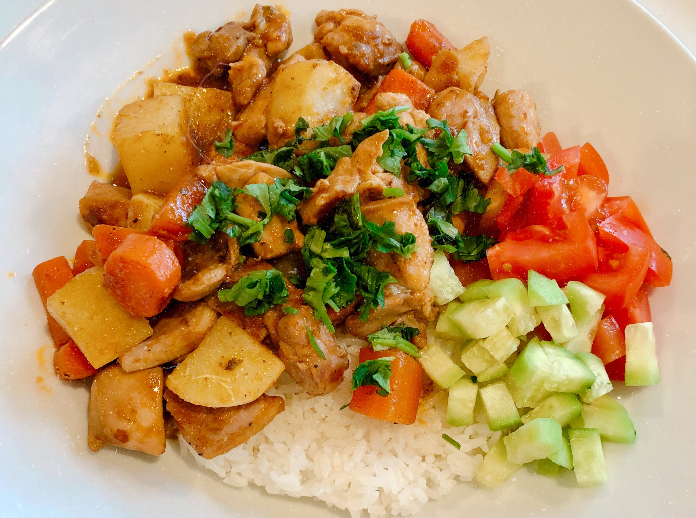

## 食材

> 2 人份

| 材         | 量   | 备注               |
| :--------- | :--- | :----------------- |
| 去骨鸡腿肉 | 500g |                    |
| 胡萝卜     | 2 根 |                    |
| 土豆       | 1 个 |                    |
| 洋葱       | 1 个 |                    |
| 新鲜罗勒叶 | 少量 |                    |
| 黄瓜       | 少量 | 可不放             |
| 番茄       | 少量 | 可不放             |
| 咖喱粉/酱  | 适量 | 根据颜色和味道调整 |
| 姜         | 3 片 |                    |
| 料酒       | 少量 |                    |
| 酱油       | 少量 |                    |
| 冰糖       | 3 颗 | 可不放             |
| 胡椒粉     | 3 颗 | 看个人口味放       |

## 步骤

1. 鸡肉、姜、胡萝卜、土豆、洋葱洗净切块
2. 大火油锅爆香姜片，然后放入鸡肉翻炒，加料酒
3. 放入胡萝卜、咖喱、酱油、冰糖，适量加水，炖 20-30 分钟
4. 完成之前 15 分钟放入土豆
5. 完成之前 5 分钟放入洋葱
6. 放盐调味 <em>（（如果要收汁就少放点）</em>
7. 出锅前收汁，用淀粉勾芡<em>（可跳过）</em>
8. 撒罗勒叶、黄瓜丁、番茄丁

## 备注

- 咖喱酱牌子推荐：[Maya Kaimal Simmer Sauces](https://www.mayakaimal.com/product-categories/indian-simmer-sauces/)
