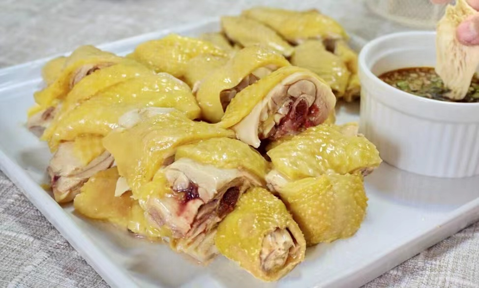

## 食材

> 2 人份

##### 做鸡肉的材料

| 材     | 量        | 备注   |
| :----- | :-------- | :----- |
| 三黄鸡 | 1000g     |        |
| 姜     | 4 ～ 6 片 |        |
| 葱     | 2 根      | 可不放 |
| 八角   | 2 个      | 可不放 |
| 料酒   | 适量      |        |

##### 做蘸料的材料

| 材       | 量   | 备注 |
| :------- | :--- | :--- |
| 姜末     | 少量 |      |
| 蒜末     | 少量 |      |
| 香菜碎   | 适量 |      |
| 蒸鱼豉油 | 适量 |      |

## 步骤

1. 准备 2 大锅纯净水（水量要能完全盖过鸡），没有大锅就把鸡一分为二
2. 一个锅中加姜、八角、葱，煮沸放料酒
3. 水开后，拎起鸡，放入锅中烫一下就提起，重复 3 次
4. 把鸡整个放入锅中，开盖煮 1 分钟，捞出放入另一口锅冷水浸泡后捞出
5. 再次放入锅中开盖煮 4 分钟
6. 盖上锅盖煮 1 分钟后关火，根据鸡的大小焖 40--50 分钟
7. 捞出冷却（如果要脆皮的口感，捞出后浸泡在冰水中 10 分钟）
8. 需要皮色金黄的话，抹上香油

## 备注

- 煮鸡的汤可以用来煮面、馄饨，做汤底
